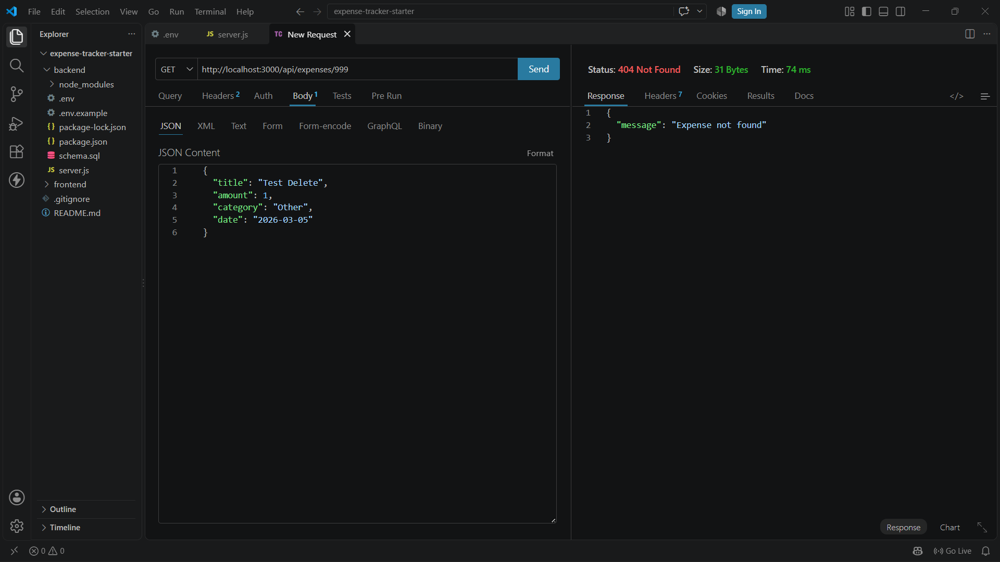
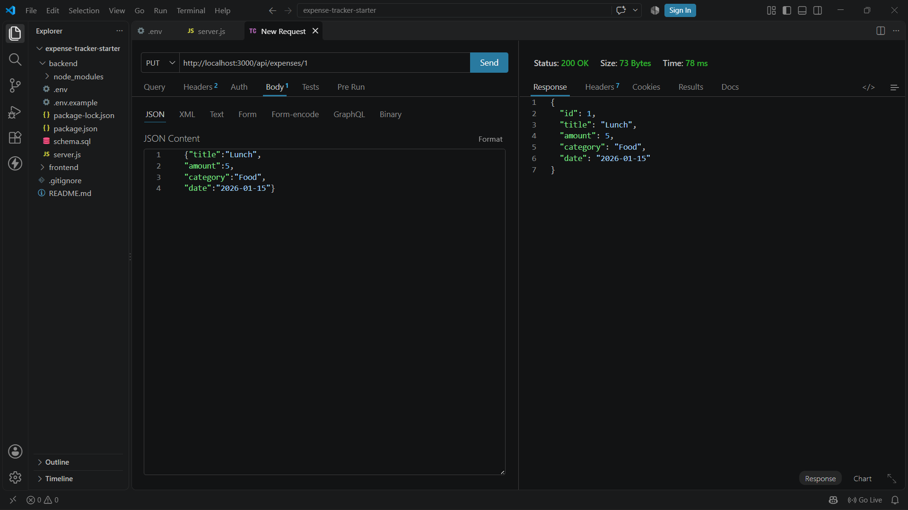
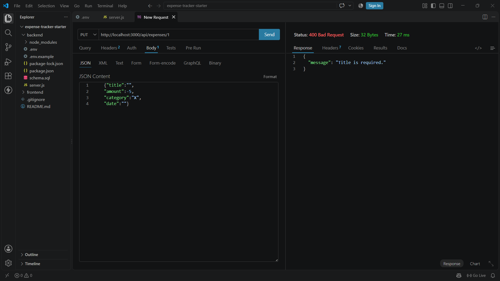
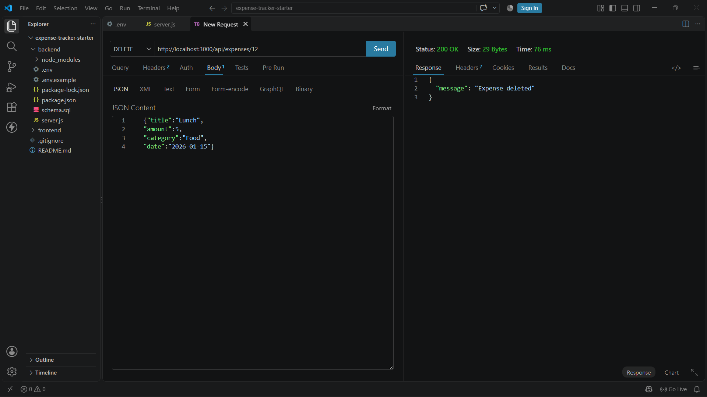
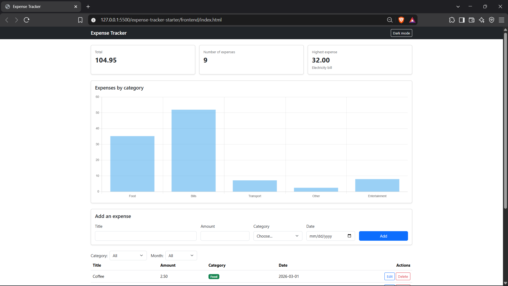
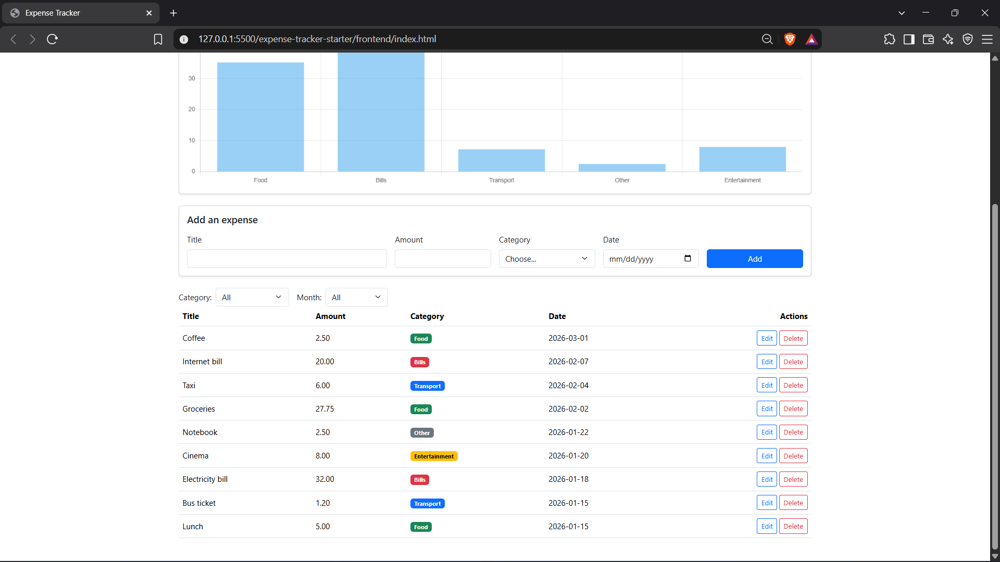
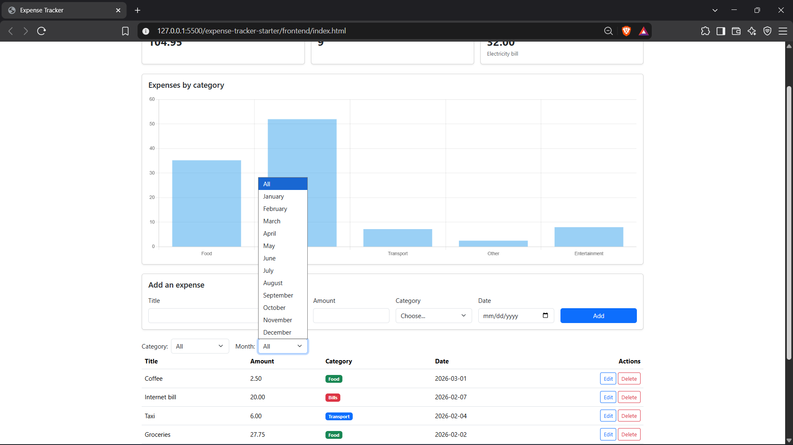
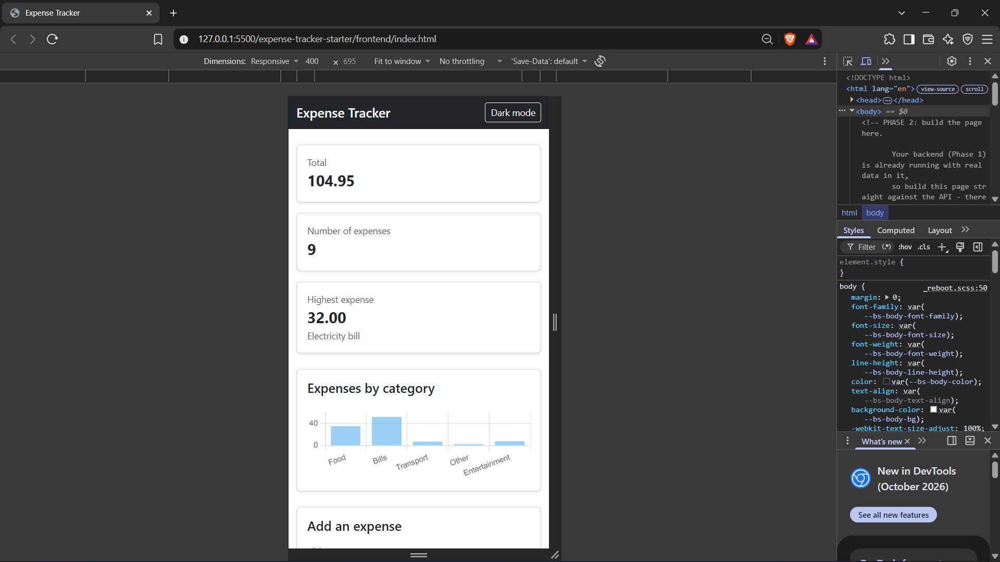
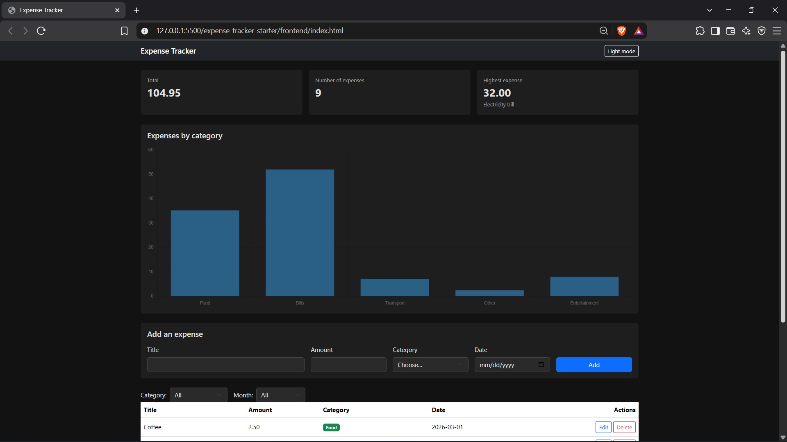

# Expense Tracker

A web app to track personal expenses. Add an expense (title, amount, category,
date), see them all in a table, filter by category and month, and view the
total, count, and highest expense at a glance — with a bar chart of spending
by category. Data is stored in PostgreSQL through a Node.js/Express API.

## How to run

**Backend**

1. Create an empty database named `expense_tracker` in pgAdmin.
2. Run `backend/schema.sql` on it (creates the `expenses` table and sample data).
3. In `backend`, copy `.env.example` to a new file named `.env` and write your
   PostgreSQL password.
4. Open a terminal in `backend` and install the packages:
5. Start the server:
   The API runs at `http://localhost:3000`.

**Frontend**

1. Open `frontend/index.html` in VS Code.
2. Right-click it and choose **Open with Live Server** (the backend must be
   running first).

## API

| Method | Path              | Description          | Success | Errors   |
|--------|-------------------|-----------------------|---------|----------|
| GET    | /api/expenses      | Return all expenses   | 200     | —        |
| GET    | /api/expenses/:id  | Return one expense    | 200     | 404      |
| POST   | /api/expenses      | Add a new expense     | 201     | 400      |
| PUT    | /api/expenses/:id  | Update an expense     | 200     | 400, 404 |
| DELETE | /api/expenses/:id  | Delete an expense     | 200     | 404      |

## Images

## Features

- [x] Add an expense (with validation)
- [x] Delete an expense
- [x] Edit an expense (Bootstrap modal)
- [x] Filter by category
- [x] Summary cards (total, count, highest) — laid out with CSS Grid
- [x] Data is saved in a PostgreSQL database
- [x] Loading spinner and clear error/success alerts
- [x] Responsive on mobile

**Bonus:**
- [x] Bar chart of expenses by category (Chart.js)
- [x] Filter by month
- [x] Dark mode (saved with localStorage)

## Screenshots

## What was the hardest part?

The trickiest part was getting the backend fully correct before touching the
frontend. PostgreSQL returns `amount` as text and `date` as a JavaScript
`Date` object by default, which broke the JSON shape the frontend expected —
I fixed it with `amount::float8` and `to_char(date, 'YYYY-MM-DD')` in every
SELECT. I also ran into an `EADDRINUSE` error a few times from an old server
still running in another terminal, and a `.env` file that wasn't being read
correctly at first — restarting the server after every change and
double-checking the file name and path solved both.

## Links & Demo
* **GitHub Repository:** [https://github.com/randmaghierh-commits/First-Project]
* **Demo Video:** [https://drive.google.com/file/d/1uxj63IgLqO2k7YJSV3O4NW8kTXS1Pfcp/view?usp=drive_link]